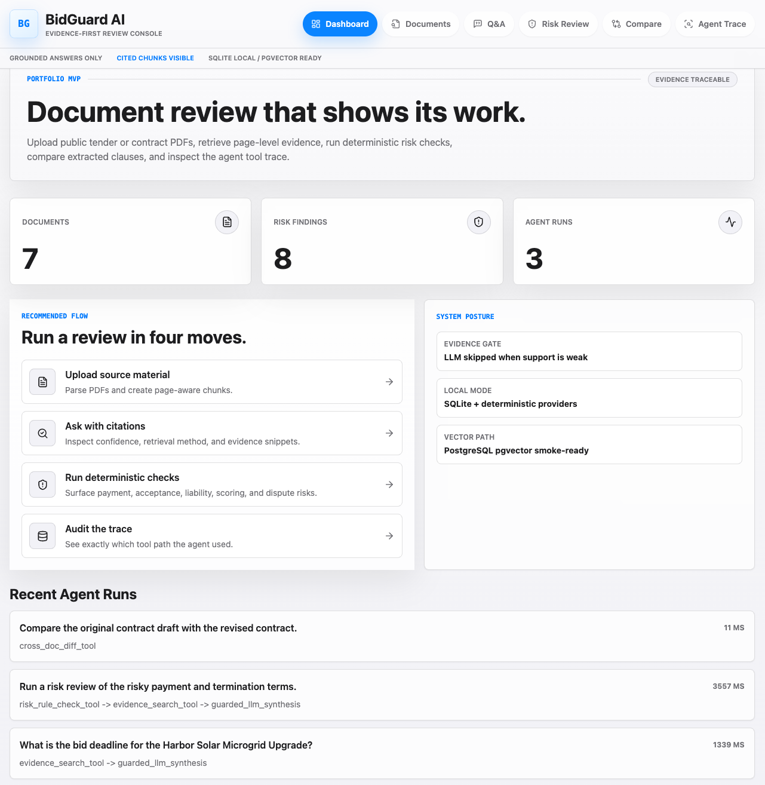
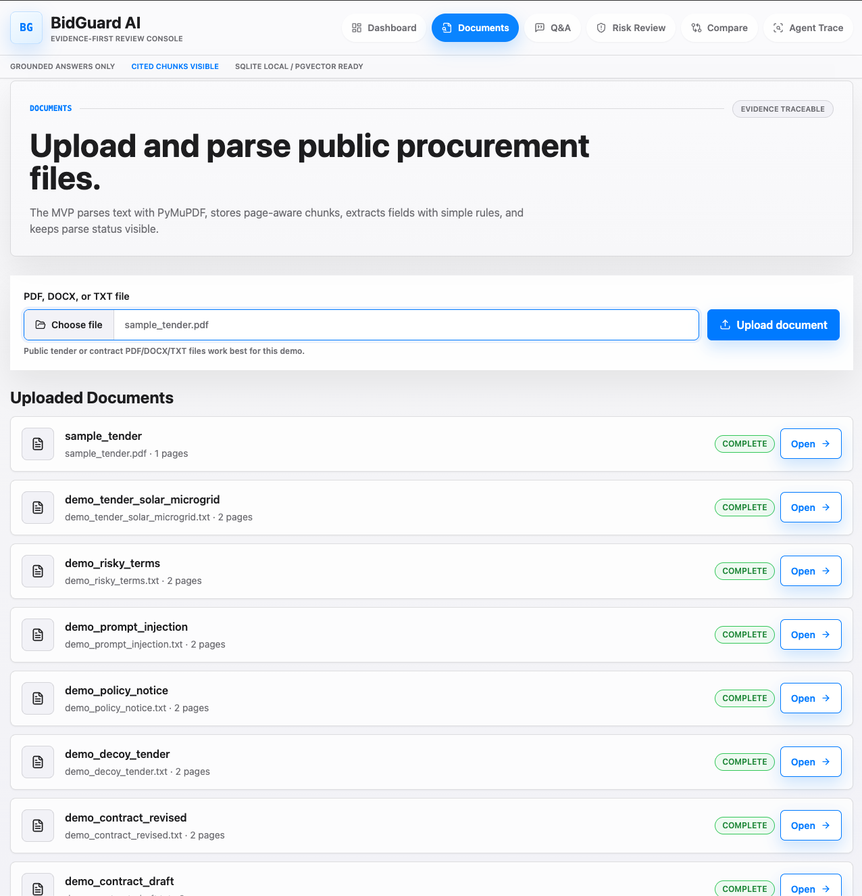
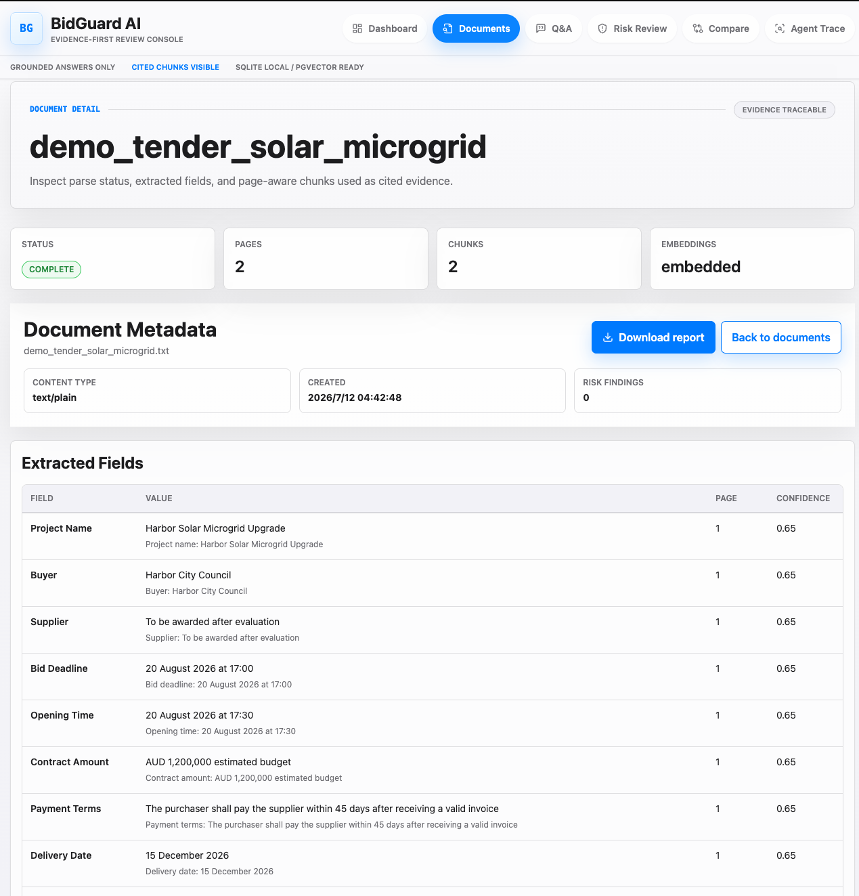
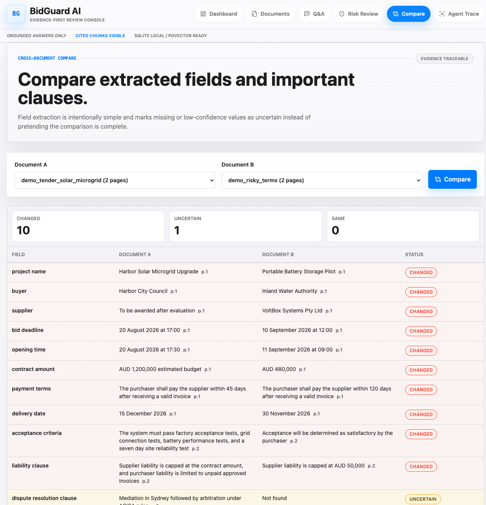
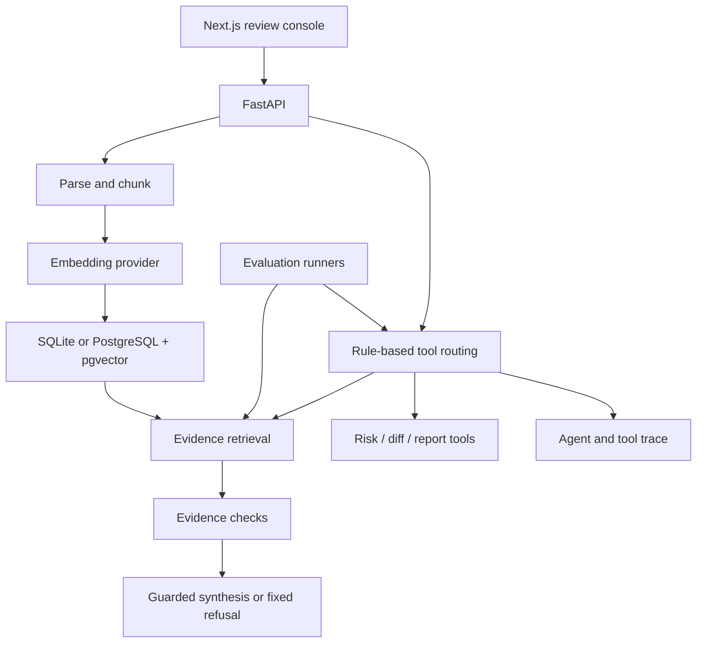

# BidGuard AI

**English** | [简体中文](README.md)

**Evidence-first tender and contract review. Answers linked to source text, with risk checks and an inspectable tool trace.**

[](https://github.com/AZ123IT/BidGuard-AI/actions/workflows/ci.yml)

[Demo walkthrough](docs/demo_walkthrough.md) · [Architecture](docs/architecture.md) · [Evaluation & failures](docs/evaluation_failure_analysis.md)

BidGuard AI is a personal full-stack AI engineering project for reviewing tender documents and contract drafts. Upload a document, ask about a clause, and inspect the retrieved source text instead of relying on an unsupported answer.

The project goes beyond document chat: it combines **RAG, deterministic risk checks, contract-version comparison, review report export, and tool-call observability**. It is a portfolio application, not a legal-advice service or a production compliance system.

## See It In Action

A real application capture: a bid-deadline answer with its source document, page, chunk, retrieval scores, and `pgvector` retrieval method.


<details>
<summary><strong>More screenshots: dashboard, documents, and contract comparison</strong></summary>

### Review Dashboard

Document counts, risk findings, and recent agent runs.



### Document Ingestion

Upload PDF, DOCX, or TXT files and inspect parsing status.



### Document Detail

Inspect extracted fields and navigate page-aware text chunks.



### Cross-Document Comparison

Compare extracted values and inspect changed or missing clauses. The screenshot compares two synthetic documents; the walkthrough also includes an original/revised contract pair.



</details>

Screenshots use synthetic demo data. Scores are retrieval signals, not calibrated probabilities; document and run counts reflect that demo session.

## What Is Implemented

| Capability | Implementation |
| --- | --- |
| Document ingestion | PDF text extraction, lightweight DOCX/TXT parsing, page-aware chunks, stored metadata |
| Evidence Q&A | Retrieved snippets with document, page, chunk ID, scores, and source navigation |
| Guarded synthesis | Evidence checks before LLM use; a fixed refusal when support is insufficient |
| Risk review | Eight deterministic rules covering payment, acceptance, liability, and related terms |
| Contract comparison | Eleven extracted fields/clauses; changed, same, or uncertain results |
| Report export | Downloadable Markdown review report |
| Agent trace | Rule-routed tools with recorded inputs, outputs, status, and latency |
| Evaluation | Workflow regression, retrieval baselines, provider smoke, and pgvector smoke checks |

**Not implemented:** OCR, pixel-level PDF highlighting, autonomous multi-agent planning, or production legal validation. DOCX/TXT source references are logical sections, not guaranteed original printed page numbers.

## Engineering Design

**Stack:** FastAPI · Pydantic · SQLAlchemy · Alembic · Next.js · TypeScript · Tailwind CSS · SQLite · PostgreSQL / pgvector



- **Evidence before generation.** Retrieve and filter chunks before synthesis. Weak or empty evidence skips the LLM and returns exactly:
  > The uploaded documents do not contain enough evidence to answer this question reliably.
- **Interchangeable providers.** OpenAI-compatible embedding and chat adapters separate model configuration from ingestion and retrieval.
- **Inspectable routing.** A lightweight rule-based workflow selects evidence search, risk checking, comparison, or report generation. It is not LLM-driven autonomous planning.
- **Measured retrieval.** Compare keyword, deterministic-vector, and real semantic-vector paths before adding retrieval complexity.

### Runtime Modes

| Mode | Storage and providers | Intended use |
| --- | --- | --- |
| Zero-key local | SQLite, deterministic hash embeddings, local fake/extractive synthesis | Reproducible setup, development, and tests |
| Vector infrastructure | PostgreSQL + pgvector, local deterministic providers | Verify migrations, vector storage, and retrieval plumbing |
| Real-provider demo | PostgreSQL + pgvector, semantic embeddings, OpenAI-compatible LLM | Optional end-to-end semantic retrieval and synthesis |

The recorded real-provider experiment used **Ollama `embeddinggemma` + DeepSeek**. Local hash vectors are a test fallback, not semantic embeddings. Real services require separate setup; external API usage can incur charges.

## Evaluation: Results And Limits

Two separate datasets serve different purposes:

- **[36 workflow cases](data/eval_cases/rag_demo.json):** Q&A, refusal, hard negatives, prompt-injection examples, risk rules, document diff, and tool routing.
- **[16 retrieval challenges](data/eval_cases/retrieval_benchmark.json):** direct questions, paraphrases, similar-but-wrong clauses, and an injection example.

Recorded comparison from **2026-07-10**, on the same small synthetic retrieval set:

| Retrieval configuration | Recall@5 | MRR | Mean retrieval latency |
| --- | ---: | ---: | ---: |
| Keyword baseline | 56.3% | 0.52 | 0.16 ms |
| Local deterministic fallback, 64 dimensions | 56.3% | 0.52 | 0.19 ms |
| pgvector + Ollama semantic embeddings, 64 dimensions | 68.8% | 0.63 | 98.11 ms |

The semantic-vector configuration retrieved the expected evidence for **11/16 cases versus 9/16** for the keyword baseline. This compares complete retrieval configurations, not a speed or quality gain caused by pgvector alone.

**What did not improve:** the benchmark's fixed extractive answer-keyword score stayed at **43.75%**. Better evidence ranking did not automatically produce better answers. The 36/36 workflow result is regression coverage, not proof of general accuracy or legal reliability. These are historical local measurements, not a live service SLA or a held-out production benchmark.

See the [experiment and failure analysis](docs/evaluation_failure_analysis.md) for missed clauses, dimension comparisons, metric definitions, and limitations. The [real-provider report](docs/real_provider_demo.md) records configuration, latency, token usage, and estimated cost.

## Quick Start

**Requirements:** Python 3.11+, Node.js 22, and npm. The default setup needs neither Docker nor API keys. Commands below use macOS/Linux shell syntax.

```bash
git clone https://github.com/AZ123IT/BidGuard-AI.git
cd BidGuard-AI
```

**Backend**, from the repository root:

```bash
cd backend
python3 -m venv .venv
.venv/bin/python -m pip install -r requirements-dev.txt
[ -f .env ] || cp .env.example .env
.venv/bin/uvicorn app.main:app --reload --port 8000
```

**Frontend**, in a second terminal from the repository root:

```bash
cd frontend
npm ci
[ -f .env.local ] || cp .env.example .env.local
npm run dev
```

Open [the app](http://localhost:3000) or [API documentation](http://localhost:8000/docs). Existing environment files are preserved; if you already configured external providers or PostgreSQL, those settings still apply.

**Try the evidence trail:** upload [the sample tender PDF](data/sample_docs/sample_tender.pdf), ask `What is the bid deadline?`, then open the cited source chunk. Ask `What is the vendor tax ID?` to exercise the insufficient-evidence path.

For risk checks and draft/revision comparison, follow the [demo walkthrough](docs/demo_walkthrough.md) using the [synthetic document pack](data/sample_docs/demo_pack/).

## Verification

After installing both sets of dependencies, run from the repository root:

```bash
python3 scripts/verify_all.py
```

This runs **eight checks**: backend tests, Ruff, local provider smoke, smoke evaluation, the 36-case workflow evaluation, the 16-case retrieval benchmark, frontend typecheck, and production build. Backend checks use local providers and temporary SQLite storage rather than real API keys.

Optional Docker verification:

```bash
python3 scripts/verify_all.py --with-pgvector
```

This also starts the Compose PostgreSQL service, runs pgvector smoke, and stops it on successful completion. Use a disposable demo database with matching vector dimensions; see [database setup](docs/database_design.md). [GitHub Actions](https://github.com/AZ123IT/BidGuard-AI/actions/workflows/ci.yml) runs backend tests/lint and frontend typecheck/build without real API keys.

## Explore The Project

| Read | Purpose |
| --- | --- |
| [Demo walkthrough](docs/demo_walkthrough.md) | Upload, Q&A, refusal, risk, diff, trace, and verification commands |
| [Architecture](docs/architecture.md) / [Database design](docs/database_design.md) | Components, persistence, SQLite fallback, and pgvector setup |
| [Agent workflow](docs/agent_workflow.md) | Tool selection, evidence checks, and trace behavior |
| [Evaluation design](docs/evaluation_plan.md) / [Failure analysis](docs/evaluation_failure_analysis.md) | Coverage, metrics, observed weaknesses, and reproducible experiments |
| [Real-provider demo](docs/real_provider_demo.md) | Optional semantic embedding and LLM validation |
| [Interview brief](docs/interview_brief.md) / [中文学习手册](docs/system_learning_cn.md) | Project explanation, engineering trade-offs, and interview preparation |
| [Documentation index](docs/README.md) / [Release notes](docs/release_notes_v0_1.md) | Additional guides and release scope |

## Boundaries And Next Steps

This is a single-user portfolio project, not a hosted enterprise service. Risk checks and field extraction are heuristic; evidence checks and injection filtering reduce some failure modes but do not guarantee faithful or secure output. English synthetic documents dominate the current evaluation set.

Next priorities are broader, independently labeled evaluation data, improved clause extraction, and retrieval changes justified by measured failures. OCR and PDF highlighting remain future work. See the [roadmap](docs/development_roadmap.md).

Only public or synthetic documents should be used for demonstrations. Keep API keys, local databases, uploads, and generated reports out of Git.
