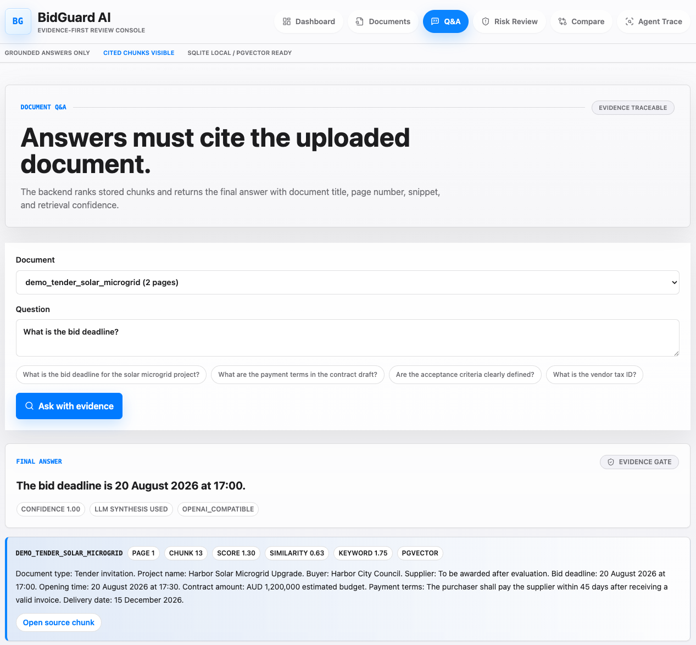

# BidGuard AI

**简体中文** | [English](README.en.md)

**招投标与合同文档审查 RAG Agent：回答附原文证据，风险检查与工具调用过程可追溯。**

[](https://github.com/AZ123IT/BidGuard-AI/actions/workflows/ci.yml)

[演示步骤](docs/demo_walkthrough.md) · [系统架构](docs/architecture.md) · [实验与失败分析](docs/evaluation_failure_analysis.md)

BidGuard AI 是一个个人全栈 AI 工程项目。用户上传招标文件或合同后，可以询问具体条款、查看回答对应的原文片段、运行规则化风险检查，并比较不同合同版本。

项目的重点不是让模型“说得像专家”，而是让使用者能核对：**回答依据是什么、证据来自哪里、系统调用了什么工具、哪些问题仍无法可靠回答。** 本项目不提供法律意见，也不承诺合规性或风险检出率。

## 系统演示

下面是真实运行截图：回答投标截止时间，同时展示文档、页码、chunk、检索分数和来源入口。



[查看完整界面截图](README.en.md#see-it-in-action)：Dashboard、文档上传、文档详情与跨文档比较。截图使用合成演示数据；检索分数不是经过校准的正确率。

## 项目做了什么

| 功能 | 实现与边界 |
| --- | --- |
| 文档处理 | PDF 文本提取、轻量 DOCX/TXT 解析、分块与持久化；不含 OCR |
| 证据问答 | 检索片段后生成回答，展示文档、页码、chunk ID、分数和来源跳转 |
| 证据门控 | 过滤部分注入片段与弱证据，证据不足时跳过 LLM 并返回固定拒答 |
| 风险检查 | 8 条确定性规则，覆盖付款、验收、责任等条款；不等同于法律审查 |
| 文档比较 | 比较 11 个抽取字段或条款，标注差异、相同项与不确定项 |
| 报告与追踪 | 导出 Markdown 审查报告，查看工具输入、输出、状态与耗时 |
| 工程验证 | 工作流评估、检索对照实验、Provider/pgvector smoke 和无密钥 CI |

DOCX/TXT 的来源引用是逻辑段落或文本分组，不保证与原文件打印页码一致。证据查看器是文本 chunk 定位，不是 PDF 像素级高亮。

## 技术设计

**技术栈：** FastAPI、Pydantic、SQLAlchemy、Alembic、Next.js、TypeScript、Tailwind CSS、SQLite、PostgreSQL / pgvector。

核心链路：

```text
上传文档 → 解析与分块 → Embedding → 存储
用户问题 → 证据检索 → 证据检查 → 受约束生成 / 固定拒答
                                  ↓
                         原文引用与工具调用记录
```

- **不仅是文档聊天：** 集成规则检查、合同版本比较、报告导出和可查看的工具调用记录。
- **模型可替换：** Embedding 与 LLM 分别通过 OpenAI-compatible Provider 接入，业务逻辑不绑定单一厂商。
- **Agent 边界清楚：** 当前按规则路由到检索、风险、比较或报告工具，不是模型自主规划的多 Agent 系统。
- **先评估再增加复杂度：** 同时保留 keyword baseline、本地确定性向量与真实语义向量路径，用实验判断改进是否有效。

### 三种运行模式

| 模式 | 配置 | 用途 |
| --- | --- | --- |
| 本地零密钥 | SQLite + 确定性 hash embedding + 本地模拟/抽取式输出 | 快速启动、重复测试 |
| 向量基础设施 | PostgreSQL + pgvector + 本地 Provider | 验证迁移、向量存储和检索链路 |
| 真实模型演示 | PostgreSQL + pgvector + 语义 embedding + 真实 LLM | 验证实际语义检索与生成 |

历史实跑使用了 **Ollama embeddinggemma 与 DeepSeek**。本地 hash embedding 不是语义模型；真实模型模式需要单独配置服务，外部 API 可能产生费用。

## 评估结果，不只展示通过率

- **[36 条工作流案例](data/eval_cases/rag_demo.json)：** 覆盖问答、拒答、hard negative、相似错误条款、注入样例、风险、diff 与路由。
- **[16 条检索挑战](data/eval_cases/retrieval_benchmark.json)：** 单独比较证据召回和排序，而不是把流程执行成功当作答案正确。

以下为 **2026-07-10 的历史本地实验**，使用同一组合成检索案例：

| 检索配置 | Recall@5 | MRR | 平均检索延迟 |
| --- | ---: | ---: | ---: |
| Keyword baseline | 56.3% | 0.52 | 0.16 ms |
| 本地确定性向量，64 维 | 56.3% | 0.52 | 0.19 ms |
| pgvector + Ollama 语义向量，64 维 | 68.8% | 0.63 | 98.11 ms |

语义向量配置的预期证据命中从 **9/16 增至 11/16**，但固定抽取式答案的关键词命中率仍是 **43.75%**。说明检索改善并不自动意味着回答改善，也不能把差异归因于 pgvector 数据库本身。

36/36 是工作流回归结果，**不是通用准确率或法律可靠性证明**。数据集规模小、以英文合成文档为主，也不属于独立生产盲测。失败样例、768 维对照与后续改进方向见[失败分析](docs/evaluation_failure_analysis.md)；模型、Token、延迟与估算成本见[真实 Provider 实验记录](docs/real_provider_demo.md)。

## 快速运行

需要 Python 3.11+、Node.js 22 和 npm。默认不需要 Docker 或 API key；以下命令适用于 macOS/Linux。

```bash
git clone https://github.com/AZ123IT/BidGuard-AI.git
cd BidGuard-AI
```

从项目根目录启动后端：

```bash
cd backend
python3 -m venv .venv
.venv/bin/python -m pip install -r requirements-dev.txt
[ -f .env ] || cp .env.example .env
.venv/bin/uvicorn app.main:app --reload --port 8000
```

另开终端，从项目根目录启动前端：

```bash
cd frontend
npm ci
[ -f .env.local ] || cp .env.example .env.local
npm run dev
```

打开 [localhost:3000](http://localhost:3000)，API 文档在 [localhost:8000/docs](http://localhost:8000/docs)。命令不会覆盖现有环境文件；已有的 PostgreSQL 或真实 Provider 配置仍会生效。

**建议演示顺序：**

1. 上传 [sample_tender.pdf](data/sample_docs/sample_tender.pdf)，询问 `What is the bid deadline?`，点击证据入口核对原文。
2. 询问 `What is the vendor tax ID?`，展示证据不足时的固定拒答。
3. 按[演示手册](docs/demo_walkthrough.md)加载合成文档，对 `demo_risky_terms` 运行风险检查。
4. 比较 `demo_contract_draft` 与 `demo_contract_revised`，最后查看 Agent Trace。

证据不足时的返回文本保持为：

> The uploaded documents do not contain enough evidence to answer this question reliably.

## 一条命令验证

安装前后端依赖后，在项目根目录执行：

```bash
python3 scripts/verify_all.py
```

包含 8 项检查：后端测试、Ruff、本地 Provider smoke、基础 eval、36 条工作流 eval、16 条检索 benchmark、前端类型检查与生产构建。后端检查使用本地 Provider 和临时 SQLite，不需要真实密钥。

Docker 可用时，可以额外验证 pgvector：

```bash
python3 scripts/verify_all.py --with-pgvector
```

此模式会启动 Compose PostgreSQL 服务，执行 smoke，并在成功完成后停止服务。请使用维度匹配的演示数据库，具体见[数据库文档](docs/database_design.md)。默认 [GitHub Actions CI](https://github.com/AZ123IT/BidGuard-AI/actions/workflows/ci.yml) 执行后端测试/lint 与前端类型检查/构建，不要求真实 API key。

## 继续阅读

- [架构设计](docs/architecture.md)与[数据库设计](docs/database_design.md)：模块职责、持久化、SQLite 和 pgvector 路径。
- [Agent 工作流](docs/agent_workflow.md)：工具路由、证据检查和日志行为。
- [评估设计](docs/evaluation_plan.md)与[失败分析](docs/evaluation_failure_analysis.md)：指标定义、实测结果和失败原因。
- [面试项目简述](docs/interview_brief.md)与[中文系统学习手册](docs/system_learning_cn.md)：技术原理、设计取舍和追问准备。
- [文档索引](docs/README.md)、[发布说明](docs/release_notes_v0_1.md)与[后续路线图](docs/development_roadmap.md)。

## 当前边界

这是单用户作品集项目，不是商业级合同审查平台。字段抽取和风险检查仍以启发式规则为主；证据门控与注入过滤不能保证所有回答正确或阻止所有攻击。OCR、PDF 高亮与生产级法律验证尚未实现。

后续优先扩大独立标注的评估数据、改善条款抽取，并根据失败分析调整检索。演示仅使用公开或合成文档；密钥、数据库、上传文件和生成报告不应进入 Git。
