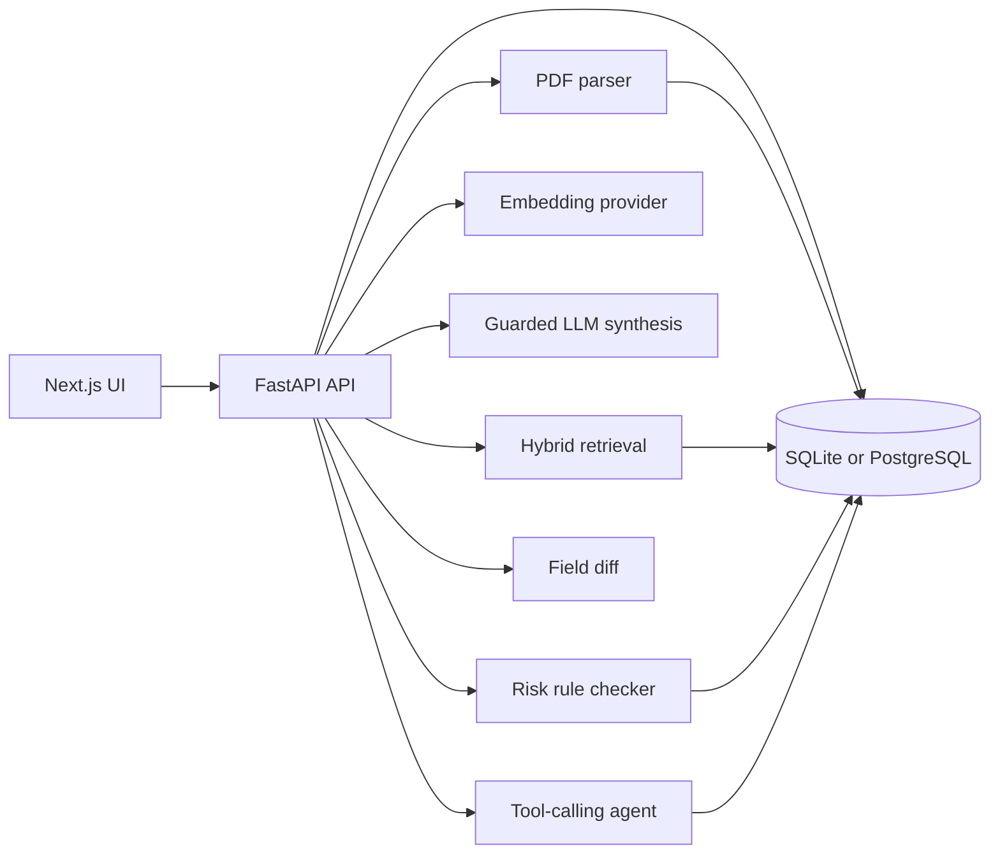

# Architecture

## System Overview

BidGuard AI is a local-first full-stack portfolio application.

## Backend Modules

- `app/main.py`: app factory, CORS, database initialization, risk rule seeding.
- `app/api/routes.py`: HTTP endpoints for health, dashboard, documents, Q&A, risk, diff, and agent trace.
- `app/models.py`: SQLAlchemy entities for documents, chunks, fields, rules, findings, runs, calls, and eval tables.
- `app/services/pdf_parser.py`: PyMuPDF text extraction.
- `app/services/chunking.py`: page-preserving chunk generation.
- `app/services/retrieval.py`: hybrid evidence retrieval, pgvector fallback handling, and evidence-first answer builder.
- `app/services/embeddings.py`: deterministic local embeddings and OpenAI-compatible embedding provider abstraction.
- `app/services/llm.py`: local fake synthesis and guarded OpenAI-compatible LLM synthesis.
- `app/services/risk_rules.py`: built-in procurement risk rules.
- `app/services/field_extractor.py`: simple regex field extraction.
- `app/services/diff.py`: structured cross-document field comparison.
- `app/services/agent.py`: lightweight tool routing and trace logging.
- `app/evaluation/run_eval.py`: deterministic eval runner for smoke and demo datasets.
- `app/evaluation/metrics.py`: boolean metric checks for retrieval, answer keywords, insufficient evidence, risk, diff, and tool routing.
- `app/evaluation/provider_smoke.py`: optional local or OpenAI-compatible provider validation without requiring PostgreSQL.

## Frontend Pages

- `/`: dashboard metrics and recent agent runs.
- `/documents`: PDF upload and document list.
- `/qa`: document selection, question input, answer and evidence list.
- `/risk`: rule-based risk review.
- `/compare`: cross-document field comparison table.
- `/agent-trace`: agent objective runner and tool call trace viewer.

## Demo and Evaluation Assets

- `data/sample_docs/sample_tender.*`: minimal smoke sample.
- `data/sample_docs/demo_pack/`: synthetic tender, contract draft, revised addendum, risky terms, and policy notice.
- `data/eval_cases/rag_smoke.json`: small smoke eval.
- `data/eval_cases/rag_demo.json`: interview-ready eval covering evidence Q&A, insufficient evidence, risk rules, cross-document diff, and agent routing.
- `docs/demo_walkthrough.md`: repeatable demo flow.

## Phase 2.2 RAG Design

The answer path is deliberately conservative. It retrieves document chunks with hybrid keyword/vector scoring and only synthesizes an answer when backend score gates pass. Otherwise it returns the fixed insufficient-evidence message.

The backend stores page numbers with every chunk. The frontend displays document title, page number, snippet, and score for each cited evidence item.

SQLite stores embeddings in the portable `document_chunks.embedding` JSON field and uses deterministic local embeddings by default. PostgreSQL enables pgvector with an `embedding_vector` column and `ivfflat` vector index. When the vector column is populated, evidence items report `retrieval_method: "pgvector"`; otherwise retrieval falls back to the SQLite-compatible hybrid path.

The vector column dimension must match `EMBEDDING_DIMENSION`. Local verification uses `64`; common hosted models such as `text-embedding-3-small` use `1536`. Set the dimension before running PostgreSQL migrations or before starting the app against a fresh database.

LLM synthesis is optional. `LLM_PROVIDER=local_fake` keeps tests deterministic. OpenAI-compatible providers are only called when configured and only after retrieved evidence passes the backend sufficiency gate. If evidence is weak or empty, the backend returns the fixed insufficient-evidence sentence without calling the LLM.

## Provider Modes

Local mode uses `EMBEDDING_PROVIDER=local` and `LLM_PROVIDER=local_fake`. It is deterministic, zero-config, and safe for tests, but it does not prove semantic retrieval quality.

Real-provider mode uses `EMBEDDING_PROVIDER=openai_compatible` and/or `LLM_PROVIDER=openai_compatible`. Real providers are validated by `backend/scripts/smoke_providers.py`; missing keys are reported as skipped instead of failing normal tests. Embedding dimension mismatches fail clearly because PostgreSQL pgvector columns must match the configured provider dimension.

The most realistic RAG demo is PostgreSQL + pgvector with a real embedding provider, followed by the demo eval. The evidence-first guard remains the same in every mode.
