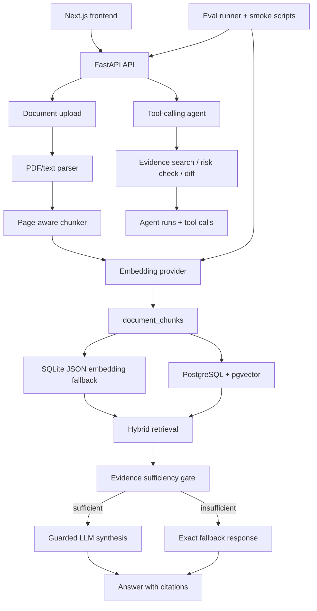

# BidGuard AI Interview Brief

## Positioning

BidGuard AI is an evidence-first tender and contract document review agent. It is a portfolio-level AI engineering project, not an enterprise SaaS product and not a legal-advice product.

It helps a user upload tender or contract documents, retrieve page-level evidence, answer document questions, run deterministic procurement risk checks, compare two document versions, and inspect the agent tool trace behind each review.

## Problem

Tender and contract review often requires checking the same facts across long documents: payment terms, bid deadlines, acceptance criteria, liability wording, dispute resolution, and changed clauses between drafts. A generic PDF chatbot can answer some questions, but it often hides retrieval quality, misses deterministic checks, and can fabricate unsupported citations.

BidGuard AI is built around the opposite constraint: every answer should be grounded in retrieved document evidence, and unsupported questions should be refused with a clear fallback.

## Why It Is Not Just a PDF Chatbot

- It stores page-aware chunks and returns document title, page number, score, retrieval method, and snippets with answers.
- It has a guarded synthesis path that skips LLM generation when evidence is weak or missing.
- It includes deterministic risk tools for common procurement review issues.
- It compares extracted fields and clauses across two documents.
- It logs agent runs and tool calls for traceability.
- It includes smoke tests and eval datasets for retrieval, insufficient evidence, risk rules, diff, and routing behavior.

## Architecture



## RAG Pipeline

1. Parse uploaded PDF or seeded text into page-level text.
2. Chunk text while preserving document id, title, page number, and chunk index.
3. Generate embeddings through either local deterministic embeddings or an OpenAI-compatible provider.
4. Store chunks and JSON embeddings in SQLite by default.
5. In PostgreSQL mode, also store `embedding_vector` for pgvector retrieval.
6. Retrieve evidence with hybrid scoring and return score metadata.
7. Run guarded synthesis only if retrieved evidence passes the sufficiency gate.
8. Return answer, evidence snippets, document title, page number, score, retrieval method, and synthesis metadata.

## Evidence-First Design

The system returns this exact sentence when evidence is weak or empty:

```text
The uploaded documents do not contain enough evidence to answer this question reliably.
```

The backend skips LLM synthesis in that case. This is the trust boundary: model output is allowed only after retrieval has produced enough cited evidence.

## Provider Abstraction

- Local mode: `EMBEDDING_PROVIDER=local`, `LLM_PROVIDER=local_fake`. This is deterministic, zero-key, and test-friendly.
- Real mode: `EMBEDDING_PROVIDER=openai_compatible`, `LLM_PROVIDER=openai_compatible`. This is optional and validated through `backend/scripts/smoke_providers.py`.
- Missing real-provider keys are reported as `skipped`, not as test failures.
- Embedding dimension mismatches fail clearly before a misleading pgvector demo.

## Storage Paths

SQLite is the default fallback. It stores embeddings as JSON and uses Python-side hybrid retrieval, which keeps the project easy to run locally.

PostgreSQL + pgvector is the realistic RAG path. It stores `embedding_vector`, verifies `vector(64)` in local deterministic mode, and reports `retrieval_method: "pgvector"` during smoke tests.

## Agent Workflow

The agent is intentionally lightweight:

- Normal document questions call `evidence_search_tool`.
- Risk review requests call `risk_rule_check_tool`.
- Compare requests call `cross_doc_diff_tool`.
- Report-style requests can use the report generator.
- Every run stores tool calls, status, latency, and output summaries for trace inspection.

## Evaluation Design

The eval runner covers:

- answerable evidence Q&A,
- insufficient-evidence refusal,
- deterministic risk rules,
- cross-document diff,
- agent routing/tool-call correctness.

Current metrics include retrieval hit, evidence page hit, answer keyword hit, insufficient-evidence correctness, risk category/keyword hit, diff field/keyword hit, tool-call correctness, average score, provider mode, database mode, and observed retrieval methods.

## Feature Matrix

| Feature | Status | Notes |
| --- | --- | --- |
| PDF upload | Implemented | FastAPI upload endpoint and frontend document page. |
| TXT/demo document seeding | Implemented | Used by eval runner for repeatable demo data. |
| Document parsing | Implemented | PyMuPDF for PDFs; seeded text path for eval/demo. |
| Page-aware chunking | Implemented | Chunks preserve document id and page number. |
| Local embeddings | Fallback/local | Deterministic hash vectors for tests and no-key demos. |
| OpenAI-compatible embeddings | Optional real provider | Validated by provider smoke when env vars are set. |
| SQLite retrieval | Fallback/local | JSON embeddings plus hybrid retrieval. |
| PostgreSQL pgvector retrieval | Implemented | Smoke script verifies pgvector path. |
| Guarded LLM synthesis | Implemented | Skipped when evidence is insufficient. |
| OpenAI-compatible LLM | Optional real provider | Validated by provider smoke when env vars are set. |
| Risk review | Implemented | Rule-based procurement checks. |
| Cross-document diff | Implemented | Regex field extraction plus structured diff rows. |
| Agent trace | Implemented | Tool calls and runs are logged. |
| Evaluation runner | Implemented | Smoke and demo eval datasets. |
| Provider smoke | Implemented | Local pass, real-provider skip/pass, dimension check. |
| OCR | Future | Intentionally not part of the current phase. |
| PDF evidence highlighting | Future | Evidence snippets exist; visual highlight anchors are future work. |
| Complex SaaS features | Out of scope | No payments, tenants, approvals, or complex roles. |

## Resume Bullets

- Built a full-stack evidence-first RAG application with FastAPI, Next.js, SQLAlchemy, SQLite fallback, and PostgreSQL pgvector retrieval.
- Implemented guarded LLM synthesis that only answers from retrieved page-level evidence and returns a deterministic insufficient-evidence fallback when support is weak.
- Designed a lightweight tool-calling agent workflow for evidence search, rule-based risk review, cross-document diff, report generation, and trace logging.
- Added provider abstractions and smoke validation for deterministic local providers and optional OpenAI-compatible embedding/LLM providers.
- Created an evaluation runner and synthetic tender/contract dataset covering retrieval, refusal behavior, risk findings, diff accuracy, and agent routing.

## Current Limitations

- Local embeddings are deterministic hash vectors, not semantic embeddings.
- SQLite retrieval is a local fallback, not production vector search.
- Field extraction is regex-based and intentionally simple.
- Risk rules are deterministic checks, not legal analysis.
- OCR and PDF visual highlighting are not implemented yet.
- Real provider validation requires user-supplied API credentials in environment variables.

## What I Would Improve Next

- Validate a real embedding model and real LLM provider with non-secret local env vars.
- Add public tender PDFs and more realistic eval cases.
- Add CI coverage for PostgreSQL + pgvector.
- Improve field extraction with layout-aware table parsing.
- Add PDF page preview and evidence highlight anchors.
- Add optional OCR as an isolated worker for scanned PDFs.
